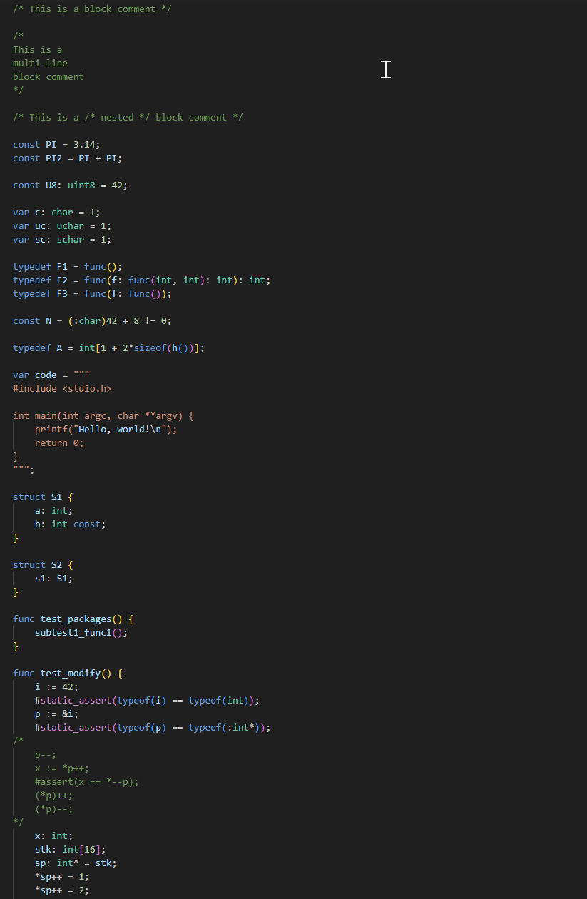

# ion-vscode

VS Code extension for the Ion programming language, providing syntax highlighting and an automatic setup system for easy debugging with GDB within Visual Studio Code.



## Project structure

For optimal functioning of the extension and gdb debugging, your workspace should adhere to the following structure:

```
WorkspaceRoot/
│
└─main/
  └─main.ion
```

Make sure at the root of your workspace there's a folder named `main`, and within that folder, a file named `main.ion` containing the main function of your Ion program.
The `task.json` expects this structure.

## Features

1. **Syntax Highlighting**: Enhanced code visibility for `.ion` files to improve readability and productivity.
2. **Automatic Setup System**:
   - Detects when a `.ion` file is opened in a workspace that doesn't have the necessary debugging configurations.
   - Prompts the user to set up the current workspace for an Ion project.
   - Automatically creates a `.vscode` folder with `launch.json` and `tasks.json` configurations, streamlining the debugging setup process.
3. **Custom GDB Debugger Path**:
   - Configurable path to the GDB debugger to match your system setup.
   - Ensures that the path is set and valid before proceeding with other setups.

## How to Install

- Clone or download the repository.
- Copy the entire repository folder into the `<user home>/.vscode/extensions` directory.
- Restart VS Code.

## Configuration

Before leveraging the full features of the extension, ensure you set up the path to your GDB debugger. To do this:

1. Go to the VS Code settings (File > Preferences > Settings or `Ctrl` + `,`).
2. In the search bar, type `IonGDB.Path` to find the extension's specific setting.
3. Set the path to where your `gdb.exe` is located.

## Release Notes

### 0.2.5

Initial release with syntax highlighting and automatic debugger setup.

**Enjoy!**
